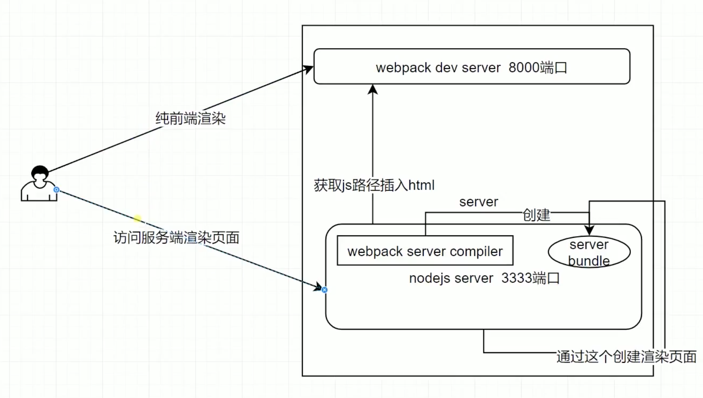

# 1 服务端渲染
## (1) SSR(服务端渲染)简介
Vue.js 可以将同一个组件渲染为服务器端的 HTML
字符串，将它们直接发送到浏览器，最后将静态标记"混合"为客户端上完全交互的应用程序。这种在服务器和客户端都可以运行的代码程序，也可以叫做“同构”。
## (2) 优点
* 有助于 SEO
* 共用前端代码，节省开发时间
* 提高首屏性能
## (3) 流程
* 使用服务端渲染的时候，首先要有个 server 端。
  因为在开发vue项目时，需要起一个webpack-dev-server的服务，端口8000。因为要使用它的热更替，这样能加快开发效率。
* 然后再起一个 node server
  由于webpack是一个自主的server，没有办法在里面添加服务端渲染的代码，而这段代码是需要自己去写的，所以需要再起一个node server，去执行服务端渲染的逻辑。
  会用到vue-server-renderer这个包来帮我们在node.js环境里面去渲染出vue代码生成的HTML代码，这部分代码是直接返回给用户的，用户可以在浏览器里直接看到HTML的内容。

* 以图为例，我们看到两个渲染的过程，两种 server。
* 如果直接访问 webpack-dev-server，就跟我们之前开发的过程一样，它是一个纯前端渲染的过程。
* 如果我们要走服务端渲染的流程，就要走node server服务，端口3333以示区别。而且需要打包一个逻辑到node端运行，通过 webpack-server-compiler 去生成一个 server bundle，也就是服务端的 app.js。
* 当 node server 获取到server bundle 之后，就可以执行vue-server-renderer，去渲染出 HTML 的代码，直接返回给用户，这样的话就不需要通过js再去渲染出页面内容，减少了用户的等待时间。
